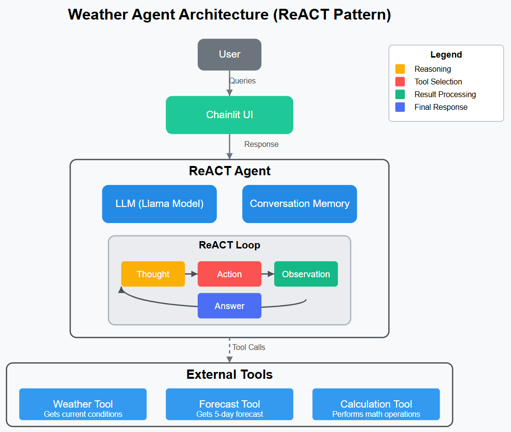
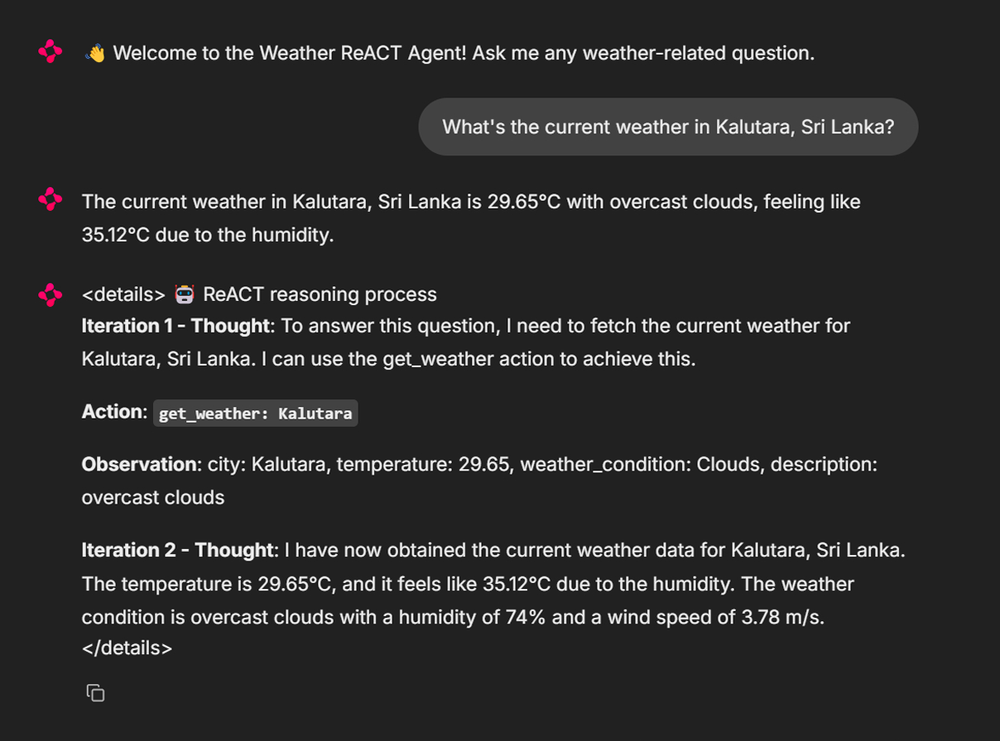
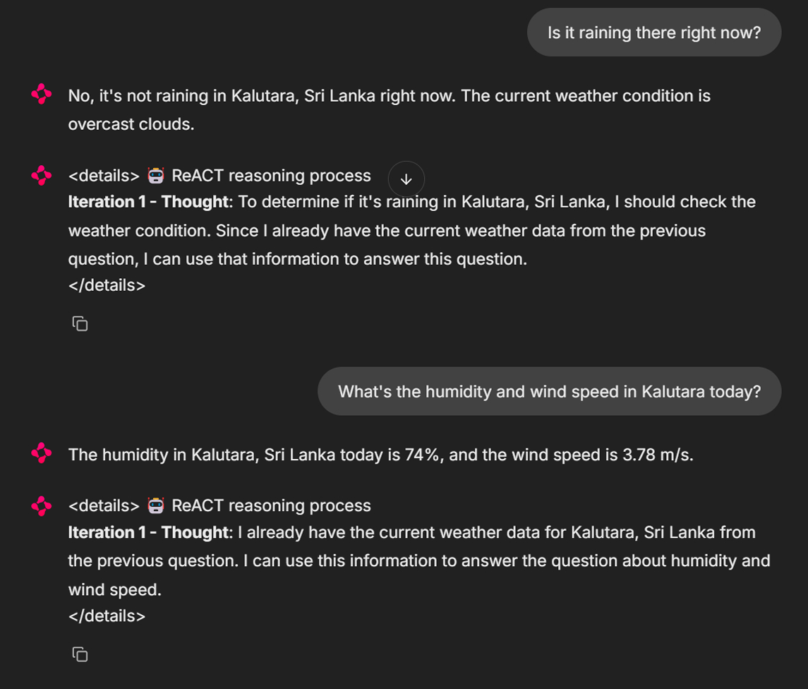
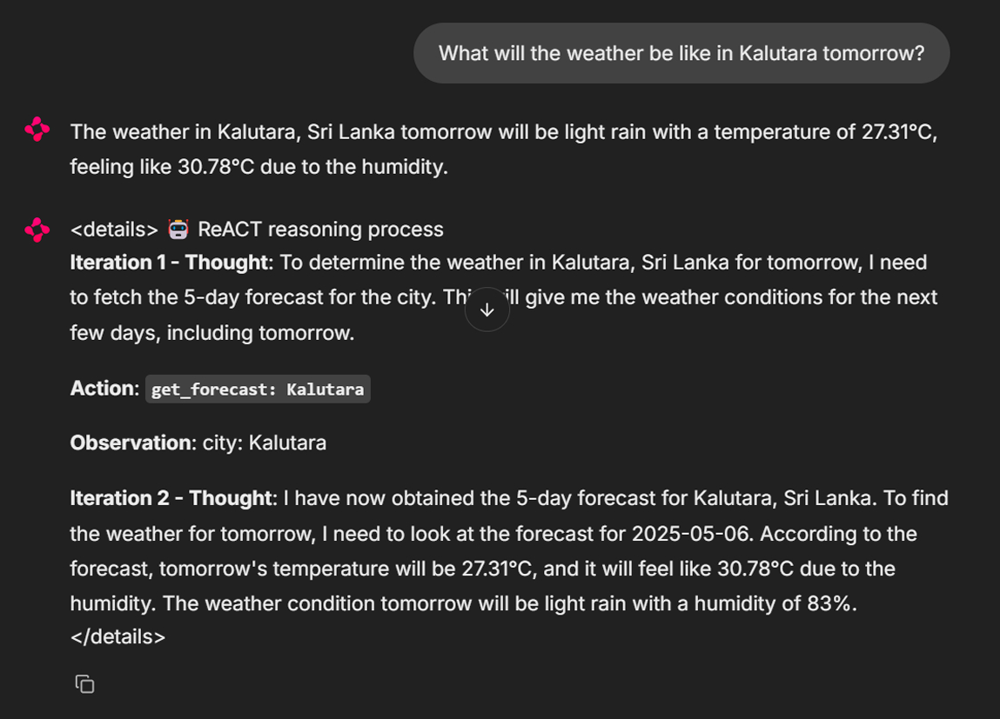
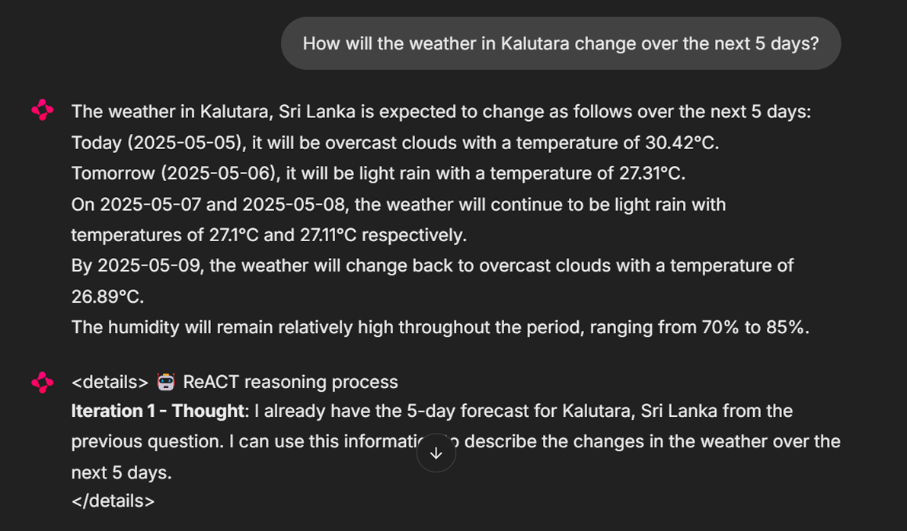
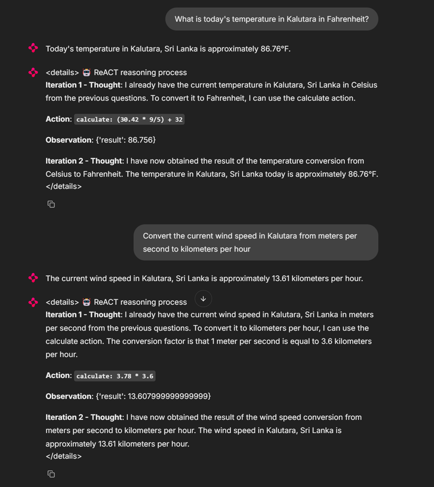
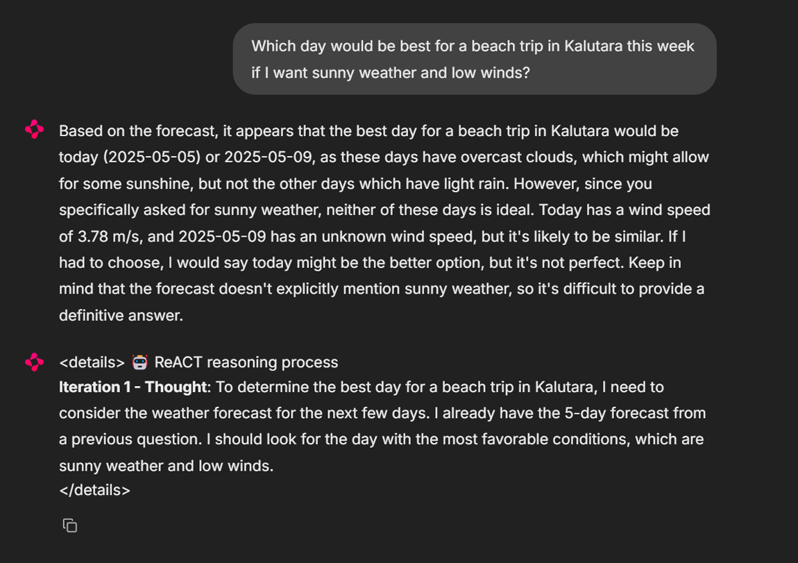

# ReACT Agent from scratch 🌤️

A conversational weather assistant built using the ReACT (Reasoning and Acting) framework that provides weather information, forecasts, and performs calculations through a chat interface.

## What is ReACT? 🤔

ReACT (Reasoning and Acting) is a framework that enables language models to solve complex tasks by interleaving **reasoning** with **actions**. It follows a specific pattern:

1. **Thought**: The agent thinks about what information it needs
2. **Action**: The agent selects and executes a tool
3. **Observation**: The agent processes the results of the action
4. **Repeat** until ready to provide a final answer

This approach allows LLMs to break down complex problems, gather relevant information, and reason step-by-step to reach accurate conclusions.

## What This Agent Does 🔍

This Weather ReACT Agent can:

- Provide current weather conditions for any location
- Show weather forecasts for the next several days
- Perform calculations and conversions (like Celsius to Fahrenheit)
- Combine weather data with calculations to answer complex queries
- Show its reasoning process for transparency

## Project Architecture 🏗️



- **Agent Core**: Implements the ReACT loop and tool execution
- **Tools**:
  - `WeatherTool`: Gets current weather data
  - `ForecastTool`: Gets weather predictions for upcoming days
  - `CalculationTool`: Performs mathematical operations
- **UI**: Built with Chainlit for an interactive chat experience
- **LLM**: Uses Groq API with LLAMA models for reasoning

## How It Works ⚙️

1. User submits a query through the Chainlit interface
2. The agent processes the query through the ReACT framework
3. When needed, the agent calls specific tools to gather information
4. The agent shows its reasoning process transparently
5. A final answer is provided based on the gathered information

## Example Queries 💬

- "What is the current weather in Kalutara, Sri Lanka?"
- "Will it rain in Kalutara tomorrow?"
- "Compare today's temperature in Kalutara with tomorrow's forecast"
- "Convert the current temperature in Kalutara from Celsius to Fahrenheit"
- "What's the average temperature in Kalutara for the next 3 days?"

## Setup Instructions 🚀

1. Clone the repository
2. Install dependencies: `pip install -r requirements.txt`
3. Set up the environment variables:
   ```
   GROQ_API_KEY=your_groq_api_key
   GROQ_MODEL=llama-3.3-70b-versatile
   OPENWEATHERMAP_API_KEY=your_openweathermap_api_key
   ```
4. Run the app: `chainlit run chainlit_app.py`

## Behind the Scenes 🔧

The agent maintains an internal conversation loop with the LLM, where each iteration follows:

```
Question: What's the weather in Kalutara and what will it be like tomorrow?
Thought: I need to check the current weather in Kalutara.
Action: get_weather: Kalutara
PAUSE

Observation: {"city": "Kalutara", "temperature": 28.5, "weather_condition": "Clouds"}

Thought: Now I need the forecast to see what it will be like tomorrow.
Action: get_forecast: Kalutara
PAUSE

Observation: {"city": "Kalutara", "forecast": [{"date": "today", ...}, {"date": "tomorrow", ...}]}

Answer: The current weather in Kalutara is 28.5°C with cloudy conditions. Tomorrow will be...
```

### Screenshots 📸







